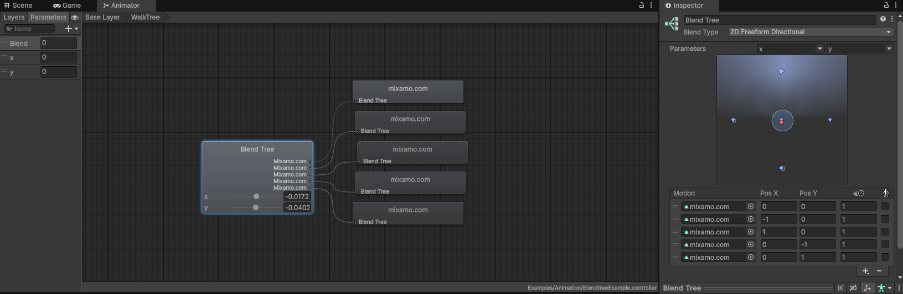

## Als eerste moet je inloggen op mixamo (zie link hier onder). Als je nog geen account heb moet je er eerst een account aanmaken of inloggen met een google account/adobe account.

https://www.mixamo.com/

## Vind het model dat je wil gebruiken op mixamo (zie link hier onder) en download deze. 

https://www.mixamo.com/#/?page=1&type=Character 

## Als je een model download heb je de mogelijkheid om te kiezen wat voor formaat het model moet komen. **HET IS STERK AANGERADEN OM DAAR FBX FOR UNITY TE KIEZEN!!**

## Sleep Het gedowloade model in een unity folder en klik er op.

## Ga naar Rig toe en verander de animation type naar "Humanoid" en verander de avatar Definition naar "Create from this model".

## Ga nu naar Animation en zet "Bake into Pose" aan op "Root Transform Position (Y)". Dit moet gedaan worden, omdat we de movement doen met rigidbody. **als je character begint met vliegen als je de scene runt dan ben je deze stap vergeten**
(Het kan ook als je character alsnog vliegt dat je dit per animatie moet doen, klik dan op edit op de animatie om op dezelfde plek te komen.)

## Ga nu naar Materials en zet "Location" op "Use External Materials (Legacy)"

## klik op de animaties in de Animations folder.

## Ga opnieuw naar Rig en verander de animation type naar "Humanoid" en verander de avatar Definition naar "Copy From Other Avatar" **Let op "Copy From Other Avatar" is anders dan "Create from this model" als bij de character**.

## Voeg bij "Source" de asset van je gedownloade character toe.

## Maak een player gameobject met Het model van Maximo dat je zojuist gedownload hebt. Voeg een Rigidbody (Constrain de X en Z rotaties zodat het character niet kan omvallen), capsule collider (y offset 1, height 2), bestaande Player Input en de Player Movement script toe. 

## Maak een animation controller en sleep deze op het gameobject van het character.

## Vervolgens klik op de character ga naar het component animator en zet "Apply Root Motion" uit.

## Ga terug naar mixamo (zie link hier onder) en importeer een Jump animatie. **LET OP FBX FOR UNITY EN WITHOUT SKIN**

https://www.mixamo.com/#/?page=1&query=jump&type=Motion%2CMotionPack

## Zet de jump animatie in de Animations folder en voer stappen 8, 9 en 10 uit met de Jump animatie die je zojuist gedownload hebt. 

## Voeg de idle en jump animaties toe aan de animation controller door deze te selecteren in de mixamo prefab (Selecteer specifiek de animation in de figuur hier onder) en te slepen naar de player instantie/gameobject, deze verschijnen nu in de animation controller.

## Ga nu naar de animation controller en open die. Links bovenin is een tabje "Parameters" te vinden. Ga daar naartoe en voeg een trigger parameter toe met de naam "Jump" **Let op als je hem niet exact "Jump" noemt gaat het fout**

## Maak een transitie (rechter muisklik) tussen idle en jump met de conditie Jump als trigger (onder conditions klik op het plusje en dan Jump).

## Nu gaan we de idle animatie in de controller vervangen met een blend tree. Rechtermuisklik op de idle animatie in de controller en klik op "Create new blendtree in state". 

## Dubbelklik de nieuwe blend tree om deze te openen en aan te passen.

## Zorg ervoor dat de blend type 2D Simple Directional is, maak twee parameters aan float X en float Y en selecteer deze in de blend tree. Nu kan je motion fields aanmaken met het '+' teken voor elke animatie, en deze in positie slepen zodat deze blended worden met de twee parameters die zijn meegegeven. 

Je kan in het plaatje zien dat alle motion fields hetzelfde heten door de import naam van mixamo, maar je kan erachter komen welke animatie waar staat door deze te selecteren in het motion field, Unity highlight dan de geselecteerde asset in de editor.
## Zet Foot IK aan op de blend tree node in de animator component.

